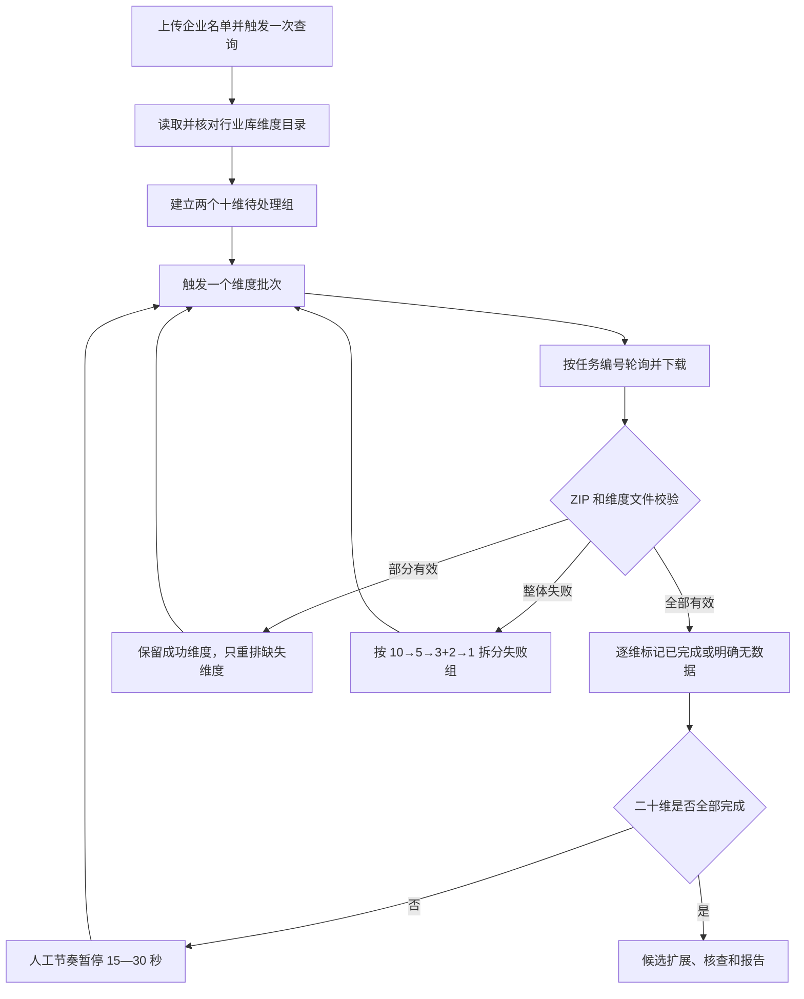

# 注协关联方维度自适应分批下载设计

## 设计结论

采用行业库现有“按维度代码导出”接口，在一次企业名单上传和查询后，按 `10 + 10` 两组提交二十个关联方核查维度。每次只保留一个活动导出任务；批次失败时只拆分未完成部分，依次降级为 `5`、`3 + 2` 和单维。成功维度永不重复提交。

该方案保留行业库原始 Excel 结构、现有 ZIP 安全校验、任务编号关联和报告引擎，改动集中在导出器及其编排状态，不引入新依赖。

## 方案比较

| 方案 | 做法 | 实现与维护成本 | 可靠性 | 兼容性 | 结论 |
|---|---|---:|---|---|---|
| A. 服务端自适应分组导出 | 复用现有导出接口，每次提交 10、5、3、2 或 1 个维度 | 中 | 高；仍使用官方原始文件和任务编号 | 高；现有报告引擎继续读取 Excel | 推荐 |
| B. 查询接口与导出接口混合 | 基础工商、股东、人员和股权走独立查询，其余维度再导出 | 高 | 中；需要把不同接口结果重新拼成统一 Excel | 中；字段口径和原始证据来源分裂 | 不采用 |
| C. Firefox 页面逐项操作 | 在页面勾选维度、点击导出并监视下载 | 高 | 低；容易受页面结构、焦点和弹窗影响 | 低；难以自动测试和断点恢复 | 不采用 |

方案 A 是最短且风险最低的路线。行业库接口本身已经接受维度代码列表，现有程序只是错误地把全部六十一个代码一次传入。新设计只改变列表的组织和任务状态，不重写登录、查询或报告系统。

## 核心约束

1. 联网范围固定为需求文档列出的二十个维度；运行时必须核对代码与名称。
2. 初始队列固定为两个十维组，第一组优先取得工商、股权和人员证据。
3. 同一时间最多一个活动导出任务。
4. 完成状态按维度记录，不按 ZIP 整体记录。
5. 已完成维度永不重新进入待处理队列。
6. 二十个维度全部完成或明确无数据前，工作流不得进入候选扩展。
7. 下载中心任务必须按已记录任务编号精确关联，不能认领“最新任务”。
8. 旧的在线六十一维整包任务不再恢复；已有完整导出目录仍可走离线入口。

## 数据流

## 状态模型

继续使用现有 `ExportState`，增加最少的可序列化字段，不另建数据库或状态服务：

- `required_dimensions`：本次核对后的二十个代码与名称；
- `dimension_results`：每个维度的状态、文件、来源批次和校验说明；
- `pending_groups`：尚待处理的维度代码组；
- `active_group`：当前活动组及其轮询轮次；
- `batch_history`：每个已触发任务的任务编号、维度、ZIP、状态和拆分来源；
- `poll_windows`：当前任务已经用过的完整轮询窗口数。

现有 `batch_no`、`company_names`、`staging_dir`、`task_id` 等字段继续保留。旧 JSON 缺少新增字段时使用默认值读取，保证已完成的旧成果仍可离线使用。

## 分组与拆分算法

### 初始分组

- 第一批十维：基础工商信息、股东信息、最新公示股东、实际控制人、最终受益人、主要人员（高管）、核心团队、对外投资（新）、参控股企业、发票信息。
- 第二批十维：客户、供应商、变更记录、法定代表人变更、经营异常、股权质押、动产抵押、商标、软件著作权、微信公众号。

### 失败拆分

- 十维失败：按原顺序拆为 `5 + 5`；
- 五维失败：按原顺序拆为 `3 + 2`；
- 三维或二维失败：拆为单维；
- 单维失败：保存进度并暂停。

拆分函数只接收未完成维度。若十维 ZIP 中已经成功取得八个维度，只把缺失的两个维度重新排队，不把八个成功维度视为失败。

## 下载与校验

1. 每个任务下载到独立批次暂存目录，ZIP 使用连续编号和维度摘要命名。
2. 解压前继续执行路径穿越检查。
3. 逐个识别 ZIP 中的 Excel 文件名，并与当前批次预期维度名称匹配。
4. 工作簿优先按“企业名称”或“公司名称”表头定位企业列；对行业库已知特殊表使用明确的列映射兜底。
5. 文件内企业集合必须属于本次上传范围。发现其他企业或无法判断来源时，该维度不得标记成功。
6. 已存在同名维度文件时先比较 SHA-256；内容一致则复用，内容不同则停止，绝不覆盖。
7. 多维 ZIP 未包含某个维度时，保留已经通过的维度，把缺失维度重新排队。
8. 单维任务成功且返回有效空表，或者成功 ZIP 可验证地没有该维度记录时，记录为“明确无数据”；不能把普通文件缺失当成无数据。
9. 每个批次 ZIP 和最终二十维清单均保留，报告引擎仍从交付目录根部读取各维度 Excel。

## 访问节奏

- 普通请求继续使用现有 2—5 秒随机等待；
- 下载中心轮询继续使用现有 10—20 秒随机等待；
- 批次成功并完成校验后，再随机等待 15—30 秒；
- 一个任务最多使用两个完整轮询窗口；第一个窗口结束后继续认领同一任务，第二个窗口仍未完成才进入拆分；
- 服务端返回 `Retry-After` 时，以服务端时间为下限并增加随机抖动；
- 所有等待函数允许在测试中注入，测试不真实休眠。

## Windows 状态写入

把现有“写临时文件后直接 `os.replace`”调整为有限重试：短暂访问冲突时按递增等待重试，始终使用同一个已完整刷盘的临时文件；重试耗尽后保留临时文件并抛出可恢复错误。任务状态和导出状态使用同一个最小辅助函数，修复共同根因。

## 错误处理

| 情况 | 处理 |
|---|---|
| 维度代码或名称变化 | 在任何导出前暂停，展示差异 |
| 同一批次多次导出不被行业库接受 | 只为未完成维度重新建立最小企业批次，成功维度不重复 |
| 任务编号为空 | 使用触发前任务集合、`batch_id` 和时间唯一关联；出现多个候选立即暂停 |
| 第一个轮询窗口超时 | 保存状态，继续同一任务的第二个窗口 |
| 第二个窗口超时 | 保留旧任务记录，只拆分其未完成维度 |
| ZIP 损坏或越界路径 | 整批拒绝，按失败组拆分 |
| ZIP 部分维度缺失 | 保留成功文件，只重排缺失维度 |
| 单维仍失败 | 保存所有成功进度并暂停，不进入候选扩展 |
| 登录中途失效 | 保存维度队列和任务编号，重新登录后恢复 |

## 代码边界

预计改动集中在：

- `scripts/cicpa/exporter.py`：维度目录、批次队列、拆分、逐维校验、状态恢复；
- `scripts/related_party_workflow.py`：完成门槛、统一原子状态保存、后续流程衔接；
- `scripts/tests/test_exporter.py`、`test_workflow.py`：新增行为测试；
- `scripts/validate_bundle.py`：忽略标准生成缓存；
- `SKILL.md`、`README.md`、`CONTEXT.md`、`references/user-flow.md`、`references/dimensions.md`、`NOTICE`、`SOURCES.json` 和更新日志：统一业务说明。

不新增第三方依赖，不改变登录客户端、候选规则或报告风险算法。

## 测试策略

### 单元测试

- 实时维度目录与固定二十维映射一致；
- 首选 `10 + 10`；
- 十维只拆失败组为 `5 + 5`；
- 五维继续拆为 `3 + 2`；
- 三维、二维拆为单维；
- 成功维度不会再次排队；
- 部分 ZIP 只重排缺失维度；
- 单维空表记录为明确无数据；
- 两个轮询窗口后才拆分；
- 状态恢复不重复上传、不重复触发成功任务；
- 原子保存短暂失败会重试，耗尽后保留临时文件。

### 集成测试

- 使用 `FakeClient` 验证一次上传、多个维度任务、精确任务编号关联和批次 ZIP 命名；
- 验证企业名称不一致、ZIP 路径穿越、同名文件内容冲突和任务歧义会阻断；
- 验证在线门槛满足后才调用候选发现和报告引擎；
- 验证旧状态文件和已有数据离线入口仍可使用。

### 真实验收

在测试全部通过后，用“四川江擎航空科技有限公司”执行受控联网任务：先尝试两个十维任务，根据真实结果自适应拆分；核对二十维清单、批次 ZIP、Excel 文件、企业名称和后续报告。

## 迁移与回滚

- 旧的已完成导出目录和旧 ZIP 不移动、不覆盖、不删除；
- 旧的等待中六十一维任务只保留作历史记录，新流程创建独立状态文件；
- 新状态读取器为旧字段提供默认值；
- 修改前对所有现有文件做集中时间戳备份；
- 若实现或真实验收失败，恢复备份文件即可回到旧代码，已下载的新批次成果继续保留，不执行自动删除。

## 残余风险

行业库没有公开接口契约，是否允许同一个 `batch_id` 连续触发多个维度组、空维度如何呈现、失败状态码含义仍需真实任务验证。设计通过逐维状态、精确任务编号、局部拆分和暂停门槛限制这些不确定性；若真实行为与假设冲突且需要改变业务边界，必须回到需求或方案阶段重新确认。
